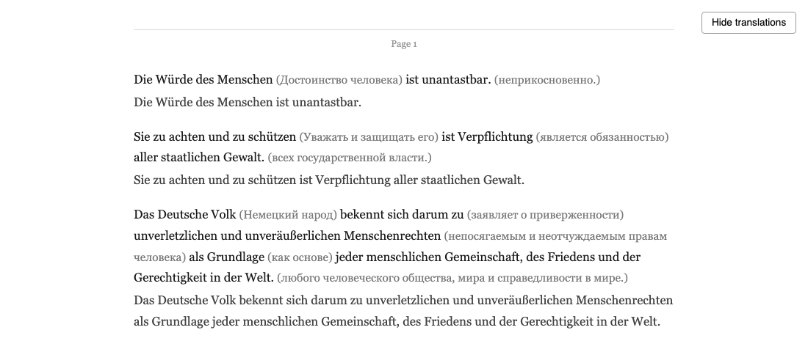
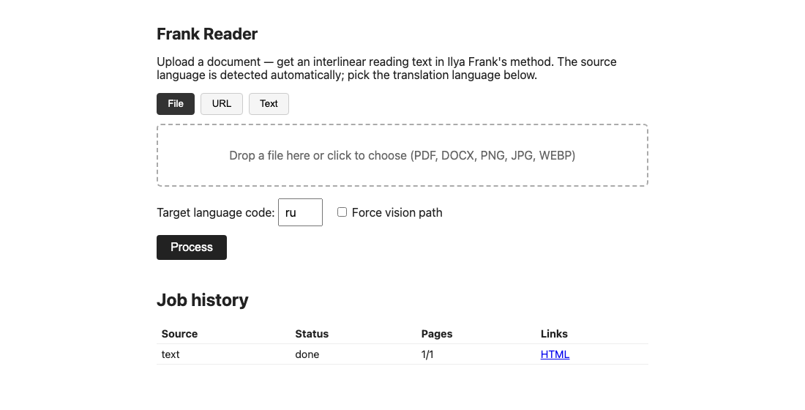

# Frank Reader

[](https://github.com/melnikaite/frank-reader/actions/workflows/ci.yml)
[](LICENSE)


A local, single-user web tool that turns documents (PDF / DOCX / images /
URLs / plain text) into interlinear reading text following [Ilya Frank's
reading method](https://en.wikipedia.org/wiki/Ilya_Frank%27s_Reading_Method):
each phrase of the original with per-chunk translations in parentheses,
followed by the same phrase without translation. Translation is done by a
local LLM through any OpenAI-compatible API (LocalAI / Ollama / LM Studio /
cloud) — nothing leaves your machine by default.

Design docs: [SPEC.md](SPEC.md) (original spec), [SPEC-IMPL.md](SPEC-IMPL.md)
(implementation spec).

## What it looks like

The result — Article 1 of the German Basic Law processed by a local Gemma 4:
per-chunk translations in gray parentheses, then the full phrase repeated.
The "Hide translations" button switches to self-testing mode. The source
language is detected automatically; the target language is chosen per job.



The UI: file drag & drop / URL / pasted text, per-page progress, job history.



## Install & run

Everything, including the PDF renderer and a bundled Cyrillic-capable font,
installs with [uv](https://docs.astral.sh/uv/) alone — no Homebrew/apt
packages, no Docker, no manual environment variables.

### As a tool (recommended for regular use)

```bash
uv tool install git+https://github.com/melnikaite/frank-reader
frank-reader                     # serves http://127.0.0.1:8200
```

Lifecycle:

```bash
uv tool upgrade frank-reader     # pull and install the latest commit
uv tool uninstall frank-reader   # remove the app (data stays, see below)
```

`uv tool install` creates an isolated virtualenv for the app under
`~/.local/share/uv/tools/` and puts the `frank-reader` command on your PATH —
your system Python and other projects are untouched. Restarting is just
stopping the process (Ctrl+C) and running `frank-reader` again; there is no
daemon. A running server keeps the old code after `uv tool upgrade` — restart
it to pick up the new version. Application data (jobs, SQLite, LLM cache)
lives in `~/.frank-reader/` and survives upgrades and uninstalls — delete
that directory to wipe it.

### From a checkout (development)

```bash
git clone https://github.com/melnikaite/frank-reader && cd frank-reader
uv sync
uv run uvicorn frank_reader.main:app --port 8200 --reload
```

## Configuration

Everything is configured via `FRANK_`-prefixed environment variables or a
`.env` file. Full list: [config.py](src/frank_reader/config.py). Key ones:

| Variable | Default | Meaning |
|---|---|---|
| `FRANK_LLM_BASE_URL` | `http://127.0.0.1:1240/v1` | OpenAI-compatible LLM endpoint |
| `FRANK_LLM_MODEL` | `gemma-4-e4b-it-qat-q4_0` | model name |
| `FRANK_LLM_REASONING_EFFORT` | `none` | suppresses Gemma 4 "thinking" (see below) |
| `FRANK_HOST` / `FRANK_PORT` | `127.0.0.1` / `8200` | where the server listens |
| `FRANK_LLM_TIMEOUT_TEXT` | `600` | max silence between stream chunks, s (not total time) |
| `FRANK_DATA_DIR` | `~/.frank-reader` | jobs, SQLite, LLM cache |
| `FRANK_TARGET_LANG_DEFAULT` | `ru` | default translation language |

### Switching the LLM backend

Developed against LocalAI + Gemma 4, but any OpenAI-compatible API works —
only the endpoint/model change:

```bash
# LocalAI (default)
FRANK_LLM_BASE_URL=http://127.0.0.1:1240/v1
FRANK_LLM_MODEL=gemma-4-e4b-it-qat-q4_0

# Ollama
FRANK_LLM_BASE_URL=http://127.0.0.1:11434/v1
FRANK_LLM_MODEL=gemma3:4b

# LM Studio
FRANK_LLM_BASE_URL=http://127.0.0.1:1234/v1

# A cloud OpenAI-compatible API: the reasoning_effort field is not supported
# there — clear it, or requests will be rejected:
FRANK_LLM_REASONING_EFFORT=
FRANK_LLM_API_KEY=sk-...
```

Vision requests can go to a separate endpoint/model (e.g. a text-only main
model plus a multimodal one): `FRANK_LLM_VISION_BASE_URL`,
`FRANK_LLM_VISION_MODEL`.

`GET /health` reports whether the endpoint is reachable and the configured
model is actually loaded — the first place to look when the backend silently
404s after a model rename.

### Known Gemma 4 / LocalAI quirks

All handled in code, but useful to know when changing the model or prompts:

- Without `reasoning_effort: "none"` Gemma 4 may spend the whole `max_tokens`
  budget on "thinking", leaving nothing for the answer.
- The answer sometimes arrives in `reasoning_content` with an empty
  `content` — the client falls back automatically.
- LocalAI can return a bare JSON array instead of an object, or wrap the
  answer in markdown fences — both are handled before validation.
- Exceeding the context window truncates silently, with no error.

Responses are streamed (`stream: true`): the timeout limits silence between
chunks rather than total generation time, and the UI shows live in-page
progress (a page on a small model takes minutes — without streaming it looks
frozen).

### Token budget and chunk size (matters on small models)

Frank-method output (original + per-chunk translation + phrase repeat, all as
JSON) is much larger than the input: ~1.2–1.5 output tokens per input
character measured on `gemma-4-e4b-it-qat-q4_0`. Verified on real documents
(ten articles of the German Basic Law, a Grimm fairy tale): with
`FRANK_LLM_MAX_TOKENS=4096` a 4000+ character page gets its JSON cut off
mid-stream — it looks like the model "loses" the end of the text, but it is
just the exhausted token ceiling. The defaults in this repo are already tuned:
`FRANK_LLM_MAX_TOKENS=16384`, `FRANK_PSEUDO_PAGE_CHARS=2500` (the same
splitting also applies to dense PDF pages). With these values both test
documents processed completely with zero failed pages.

After switching to a stronger model, these are the first two knobs to raise
(fewer calls = faster). If you see truncated phrases or JSON validation
errors on long pages, they are the first knobs to adjust (max tokens up,
chunk size down) before touching the prompts.

## PDF and printing

`GET /jobs/{id}/result.pdf` renders via
[xhtml2pdf](https://github.com/xhtml2pdf/xhtml2pdf) (pure Python on top of
reportlab) — no native dependencies, works right after `uv sync` on any
platform. A Cyrillic/Latin font (Noto Sans, SIL OFL license) is bundled in
[render/fonts/](src/frank_reader/render/fonts) and embedded at render time:
reportlab's built-in fonts have no Cyrillic glyphs, so without embedding the
translations would render as empty boxes.

Alternatively, open `result.html` in a browser and print (⌘P/Ctrl+P) — the
HTML ships print CSS (margins, no page breaks inside a phrase).

## M0 — quality check against the real model

The pipeline and web UI are fully testable without an LLM (all tests use
`FakeLLM`). The quality of the Frank-method chunking itself — the core
product risk — must be judged on the real model:

```bash
uv run python scripts/m0_check.py document.pdf --page 1 --lang ru
uv run python scripts/m0_check.py scan.png --lang en
```

Prints the model's JSON, the timing, and writes `m0_out.html` next to the
source file for visual inspection. If chunking quality or page coverage is
poor, check the token budget knobs above first, then the prompts, and only
then consider a larger model.

## Tests

```bash
uv run pytest
```

Everything but one test runs without a live LLM (`FakeLLM` + programmatically
generated document fixtures). The single integration test hits the real
LocalAI and is skipped by default:

```bash
FRANK_INTEGRATION=1 uv run pytest tests/test_integration_llm.py
```

## Project layout

See [SPEC-IMPL.md](SPEC-IMPL.md#3-project-structure).

## License

[MIT](LICENSE). Bundled Noto Sans fonts — [SIL OFL 1.1](src/frank_reader/render/fonts/OFL.txt).
